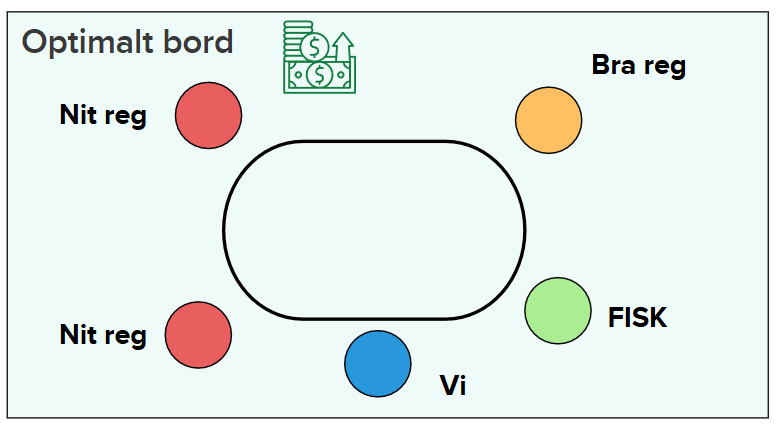

# Fish Play & Profiles

## Theory
- Playing with **one fish** at the table while you’re break‑even vs regs means you **split the fish’s losses** with the other regs.
- Examples:  
  - Fish loses **30bb/100** → your share ≈ **10bb/100**. Subtract **7bb/100** rake → **~3bb/100 net**.  
  - Fish loses **75bb/100** → your share ≈ **25bb/100**. Minus **7bb/100** rake → **~18bb/100 net**.
- To achieve high winrates you need both **above‑average skill** and **diligent table selection**.
- Avoid tables with **tight fish**; they don’t leak enough to be worth your time.
- **Position matters** — aim to sit **left** (or next‑left) of the fish.

## Winrates by Fish Type
- **Sub 40 VPIP** → ~**−17bb/100**
- **40–60 VPIP** (typical fish) → ~**−30bb/100**
- **60+ VPIP** → **−75 to −100bb/100**

## Winrates vs Regs
- **WWSF < 44** → around **−4bb/100**
- **WWSF > 48** → around **+4bb/100**

## Optimal Table Layout

- Ideal: Fish on your **right**, nit regs across/left, one competent reg far from immediate pots with the fish.

---

# Fish Profiles

## What we emphasize
- Mostly **postflop** categorization. If unsure, let **river decisions** decide the bucket.
- **Key stats to watch:** `Bet/Fold River`, broken lines (probe, delayed c‑bet, float bet), `probe` (X‑X flop, OOP leads turn), `float bet` (bet vs missed c‑bet IP).

## The Four Profiles

  <h4>Aggro folder – fokus RIVER Aggro folder</h4>
  <ul>
    <li>Hög bet river</li>
    <li>Hög raise/check-raise</li>
    <li>Höga bets overall</li>
    <li>Hög fold overall (fokus river)</li>
  </ul>

  <h4>Aggro caller – fokus RIVER Aggro caller</h4>
  <ul>
    <li>Hög bet river</li>
    <li>Hög raise/check-raise</li>
    <li>Höga bets overall</li>
    <li>Låg fold overall (fokus river)</li>
  </ul>

  <h4>Passive folder – hög FOLD Passive folder</h4>
  <ul>
    <li>Låg bet overall</li>
    <li>Låg bet i brutna linjer</li>
    <li>Låg raise/check-raise</li>
    <li>Hög fold</li>
  </ul>

  <h4>Passive caller – låg FOLD overall Passive caller</h4>
  <ul>
    <li>Låg bet overall</li>
    <li>Låg bet i brutna linjer</li>
    <li>Låg raise/check-raise</li>
    <li>Låg fold overall</li>
  </ul>

## River Tendencies
- Many fish **over‑bluff** in broken lines.
- Many fish **over‑fold** in most river spots.
- Stronger in **B‑B‑B** lines.

## Exercise
1. Create the four tags in your tracker/HUD.
2. Tag **5 players** in each bucket.
3. Review and align definitions next session.

## TODO (2024‑04‑25)
- Practice more on under‑reviewed spots.  
- Add HUD stats: **delay c‑bet**, **float bet**, **agg factor/%**, **raise/x‑raise** (overall or by street).
